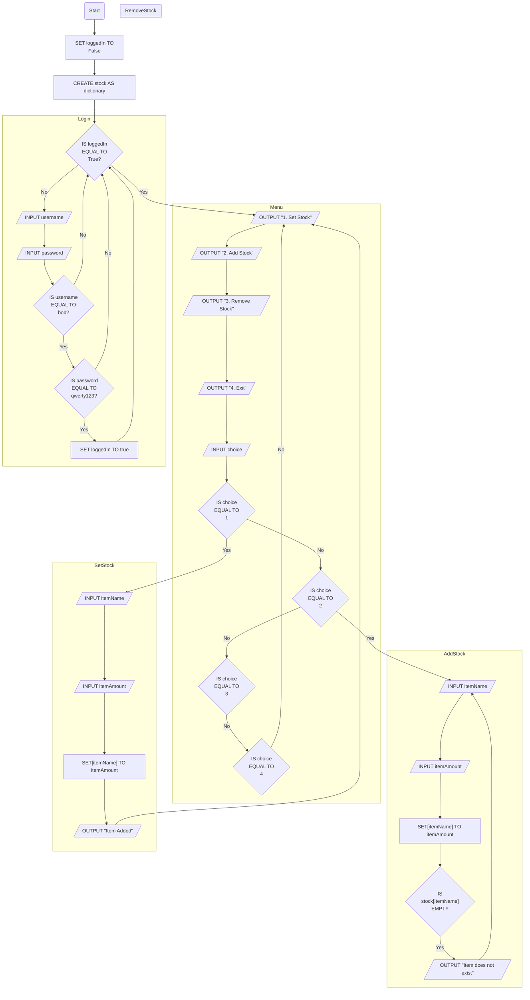

# Stock management progam

## Introduction

A local store has approached your company to help them move their stock management to a digital solution. You must design a program that helps the store keep track of their stock as well as add or remove items.

You work for a local software development company catering to local businesses. A local store has approached your company to help them move their stock management to a digital solution. You must design a program that helps the store keep track of their stock as well as add or remove items.

Your solution must:

* Contain a login system to allow only authorised employees to use it
* Offer a menu with at least 3 options: add stock, remove stock and exit
* Allow the users to add more of an existing item
* Allow the users to remove from an existing item
* Allow the users to add a new item with a quantity
* Ensure users cannot remove an item that does not exist
* Ensure users cannot remove more of an item than there is 2 in stock

You must create a flowchart and pseudocode for the above solution. Ensure your design is robust (includes validation), user friendly and complete.

## Flowchart

<!-- %%{ init : {"flowchart" : { "curve" : "linear" }}}%%
%%     -->


## Pseudocode

```
START
    SET stock TO {}

    FUNCTION login()
        INPUT username
        INPUT password
        IF username EQUAL TO "bob" THEN
            IF password EQUAL TO "qwerty123" THEN
                menu()
                RETURN
            END-IF
        END-IF
        login()
    END-FUNCTION

    FUNCTION menu()
        OUTPUT "1. Set stock"
        OUTPUT "2. Add stock"
        OUTPUT "3. Remove stock"
        OUTPUT "4. Exit"
        INPUT choice
        IF choice EQUAL TO 1 THEN
            setStock()
        ELSE-IF choice EQUAL TO 2 THEN
            addStock()
        ELSE-IF choice EQUAL TO 3 THEN
            removeStock()
        ELSE-IF choice EQUAL TO 4 THEN
            RETURN
        END-IF
    END-FUNCTION

    FUNCTION setStock()
        INPUT itemName
        INPUT itemAmount
        IF itemAmount < 1 THEN
            OUTPUT "Amount cannot be less than 1"
            setStock()
        ELSE
            SET stock[itemName] TO itemAmount
            OUTPUT "Item added"
        END
    END-FUNCTION

    FUNCTION addStock()
        INPUT itemName
        INPUT itemAmount

        IF stock[itemName] IS EMPTY THEN
            OUTPUT "Item does not exist
            addStock()
        ELSE
            SET realAmount TO stock[itemName]
            SET stock[itemName] TO realAmount + itemAmount
            OUTPUT "Item(s) Added"
        END
    END-FUNCTION

    FUNCTION removeStock()
        INPUT itemName
        INPUT itemAmount

        IF stock[itemName] IS LESS THAN itemAmount THEN
            SET realAmount TO stock[itemName]
            SET stock[itemName] TO realAmount - itemAmount
            OUTPUT "Item(s) removed"
        ELSE
            OUTPUT "Not enougth items"
            removeStock()
        END
    END-FUNCTION

    login()
END
```

##

## Testing plan


| Test Reference                       | Test Description / Purpose                                                       | Object / Item being tested | Excpected Outcome                                                               | Actual Outcome                                            | Action Required                                       | Comments |
| -------------------------------------- | ---------------------------------------------------------------------------------- | ---------------------------- | --------------------------------------------------------------------------------- | ----------------------------------------------------------- | ------------------------------------------------------- | ---------- |
| 8abfb30b-8ff8-4444-9264-93c2f32241bd | Test if the correct username "bob" is allowed.                                   | Login system               | The program asks for the password.                                              | Works as epxpected                                        |                                                       |          |
| 980ae4d6-f7ee-4203-ba37-a2f1cdea4b07 | Test if the wrong username "qw" is not allowed.                                  | Login system               | The progarm will ask for another username.                                      | The progam aks for a password instead of another username | The username check must be done before password input |          |
| e48f25be-0cc4-453e-9d9a-2f909dba17f6 | Test if no username is entered.                                                  | Login system               | The progarm will ask for another username.                                      | Same as above                                             | Same as above                                         |          |
| 9817b6bc-2bb8-4bca-a993-3143900bb113 | Test if the incorrect username "BOB".                                            | Login System               | The progarm will ask for another username.                                      | Same as above                                             | Same as above                                         |          |
| 26be1f38-cbc5-4a18-adac-f83e822e9cbb | Once the user name is correct test if the password "qwerty123" is correct.       | Login System               | The main menu appears.                                                          | Works as epxpected                                        |                                                       |          |
| bc3e43e3-897b-4b99-9ee0-1ecfd9f53d04 | Test if no password is entered.                                                  | Login System               | The program will return to the beginging asking for username.                   | Works as epxpected                                        |                                                       |          |
| a58ee9b5-b7e0-403d-ac05-1c5511ba9e8f | Test if an incorrect password "999999999999999999999999asfdghfgthyj" is entered. | Login System               | The program will return to the beginging asking for username.                   | Works as epxpected                                        |                                                       |          |
| dd635c9b-2be0-41a8-9543-ed74e8b4cfc2 | Test if an incorrect password "QWERTY123".                                       | Login System               | The program will return to the beginging asking for username.                   | Works as epxpected                                        |                                                       |          |
| d07e59f4-8e35-40c8-bb36-fce6a69fc3aa | On the menu when the user enters "1" the set stock page should appear.           | Menu                       | The set stock page appears when the user enters "1" whilst the menu is open.    | Works as epxpected                                        |                                                       |          |
| f85351d3-6e31-4c23-a9f4-54bff46f4428 | On the menu when the user enters "2" the add stock page should appear.           | Menu                       | The add stock page appears when the user enters "2" whilst the menu is open.    | Works as epxpected                                        |                                                       |          |
| 5340437e-78f7-4952-b4f3-efc8942ca81b | On the menu when the user enters "3" the remove stock page should appear.        | Menu                       | The remove stock page appears when the user enters "3" whilst the menu is open. | Works as epxpected                                        |                                                       |          |
| 0176c3f1-7b04-4832-8e38-149b28b37106 | On the menu when the user enters "4" the list stock page should appear.          | Menu                       | The remove list page appears when the user enters "4" whilst the menu is open.  | Works as epxpected                                        |                                                       |          |
| 3f8207d2-3752-4d7c-b097-ab4057074662 | On the menu when the user enters "5" the progam should exit.                     | Menu                       | The program exists when the user enters "5" whilst the menu is open.            | Works as epxpected                                        |                                                       |          |
| d5707b5e-171d-47d6-8387-0ffa56e70c29 | On the menu test if the input "0" is invalid                                     | Menu                       | The program should ask for another input                                        | Works as epxpected                                        |                                                       |          |
| c4213b52-8a77-4003-be6c-99bc4b0cf005 | On the menu test if the input "6" is invalid                                     | Menu                       | The program should ask for another input                                        | Works as epxpected                                        |                                                       |          |
| ac470ba4-cd8d-4bf7-8de0-ec8d127c4808 | On the menu test if the input "etwte335223423231412521sfsafsfdh" is invalid      | Menu                       | The program should ask for another input                                        | Works as epxpected                                        |                                                       |          |
| 44e356b3-f071-4301-a1e0-87fe6c0ed51c |                                                                                  |                            |                                                                                 |                                                           |                                                       |          |
|                                      |                                                                                  |                            |                                                                                 |                                                           |                                                       |          |
|                                      |                                                                                  |                            |                                                                                 |                                                           |                                                       |          |
|                                      |                                                                                  |                            |                                                                                 |                                                           |                                                       |          |
|                                      |                                                                                  |                            |                                                                                 |                                                           |                                                       |          |
|                                      |                                                                                  |                            |                                                                                 |                                                           |                                                       |          |
|                                      |                                                                                  |                            |                                                                                 |                                                           |                                                       |          |
|                                      |                                                                                  |                            |                                                                                 |                                                           |                                                       |          |
|                                      |                                                                                  |                            |                                                                                 |                                                           |                                                       |          |
|                                      |                                                                                  |                            |                                                                                 |                                                           |                                                       |          |
|                                      |                                                                                  |                            |                                                                                 |                                                           |                                                       |          |
|                                      |                                                                                  |                            |                                                                                 |                                                           |                                                       |          |
|                                      |                                                                                  |                            |                                                                                 |                                                           |                                                       |          |
|                                      |                                                                                  |                            |                                                                                 |                                                           |                                                       |          |
|                                      |                                                                                  |                            |                                                                                 |                                                           |                                                       |          |
|                                      |                                                                                  |                            |                                                                                 |                                                           |                                                       |          |
